# 5팀 뉴스 요약 자동화 워크플로우 만들기 기획서

- Make 워크플로우: https://eu1.make.com/public/shared-scenario/n6cy4UW8sLp/5%ED%8C%80-%EB%89%B4%EC%8A%A4-%EC%9A%94%EC%95%BD
- Notion DB: https://snowy-chameleon-2a7.notion.site/38b886ad17d880ab8b61da40fe782e54?v=38b886ad17d8808387bc000c0a05370c

## 1. 프로젝트 개요

### 1.1 프로젝트명

### 1.2 프로젝트 목적

### 1.2.1 팀 역할/개인별 작업 요약

| 역할 | 담당자 | 작업 내용 |
| --- | --- | --- |
| 팀장/프로젝트 총괄 | 이동학 | 전체 워크플로우 설계, 요구사항 검토, 최종 제출물 정리 |
| Notion 담당 | 최주원 | Notion 연결, 데이터베이스 세팅, Make-Notion 필드 매핑 |
| AI 프롬프트 담당 | 윤상원 | 요약 프롬프트, 감성/태그 분류 프롬프트 개발 |
| RSS 담당 | 김서원 | RSS 피드 연결, 초기 워크플로우 설계, 수집 데이터 확인 |

### 1.2.2 주제 필터링 기준, 키워드/태그 목록, 선택 이유

| 구분 | 기준 |
| --- | --- |
| 주제 필터링 기준 | `코스피`, `kospi` |
| 감성 키워드 | `긍정`, `부정` |
| 태그/키워드 생성 기준 | AI가 생성한 요약문을 기준으로 핵심 키워드 추출 |

선택 이유는 다음과 같다.

- `코스피/kospi`는 국내 증시 뉴스의 핵심 주제어이므로 RSS 기사 중 관련 뉴스를 선별하기 적합하다.
- `긍정/부정` 감성 키워드를 함께 분류하면 뉴스가 시장에 미치는 방향성을 빠르게 파악할 수 있다.
- 태그는 원문 전체가 아니라 AI가 정리한 요약문을 기준으로 뽑아내어, 기사 핵심 내용에 집중한 키워드 관리가 가능하다.
- 필터를 통과한 기사만 AI 분석 대상으로 삼아 불필요한 API 호출을 줄일 수 있다.

### 1.2.3 에러 처리 정책과 선택 이유

| 에러 처리 대상 | 처리 방식 |
| --- | --- |
| ChatGPT 요약 노드 | 요약 생성 실패 시 최대 2회 재시도 |
| 키워드 분석 및 태그 생성 노드 | 감성 키워드 분석 또는 태그 생성 실패 시 최대 2회 재시도 |

에러 처리 정책은 AI 응답 실패 가능성이 있는 두 노드에 집중하여 설정하였다. ChatGPT 요약 노드는 뉴스 본문을 3줄 요약으로 변환하는 핵심 단계이므로, 일시적인 API 응답 실패나 네트워크 오류가 발생할 경우 최대 2회까지 재시도하도록 하였다.

키워드 분석 및 태그 생성 노드는 요약문을 바탕으로 `긍정/부정` 감성 키워드와 핵심 태그를 생성하는 단계이다. 이 단계 역시 AI 응답 형식 오류나 일시적인 처리 실패가 발생할 수 있으므로 최대 2회까지 재시도하도록 설정하였다.

재시도 횟수를 2회로 제한한 이유는 일시적인 오류는 재시도로 해결될 수 있지만, 무제한 재시도는 불필요한 API 호출 비용 증가와 자동화 지연을 만들 수 있기 때문이다.

### 1.3 사용 도구

| 구분 | 사용 도구 | 사용 목적 |
| --- | --- | --- |
| RSS 데이터 소스 | SBS RSS | 코스피/kospi 관련 뉴스 기사 수집 |
| AI 분석 도구 | ChatGPT GPT-5 mini | 뉴스 3줄 요약, 긍정/부정 감성 키워드 분석, 태그 생성 |
| 저장 도구 | Notion DB | 제목, 요약문, 원문 링크, 발행일시, 감성 키워드, 태그 저장 |

## 2. 최종 결과물

### 2.1 자동화 워크플로우

#### 워크플로우 구조

전체 워크플로우는 Make에서 구성하였다. SBS RSS에서 최신 뉴스를 수집한 뒤 `코스피/kospi` 키워드 기준으로 1차 필터링하고, 필터를 통과한 기사들을 Array aggregator로 묶어 첫 번째 기사 1건만 후속 단계로 전달한다.

이후 Notion DB에서 GUID 기준으로 기존 저장 여부를 검색하여 중복 기사를 방지한다. 중복이 아닌 기사만 ChatGPT GPT-5 mini 요약 노드로 전달되어 3줄 요약을 생성하고, 이어서 키워드 분석 및 태그 생성 노드에서 `긍정/부정` 감성 키워드와 요약문 기반 핵심 태그를 생성한다.

키워드 분석 및 태그 생성 결과는 JSON Parse 모듈에서 구조화한 뒤 Notion DB에 최종 저장한다. ChatGPT 요약 노드와 키워드 분석 및 태그 생성 노드에는 각각 Retry 모듈을 연결하여 오류 발생 시 최대 2회까지 재시도하도록 구성하였다.

```text
SBS RSS 수집
 -> 코스피/kospi 키워드 필터링
 -> Array aggregator로 필터 통과 기사 묶기
 -> 첫 번째 기사 1건 선택
 -> Notion DB에서 GUID 중복 검사
 -> ChatGPT GPT-5 mini로 3줄 요약 생성
 -> ChatGPT GPT-5 mini로 긍정/부정 키워드 및 태그 생성
 -> JSON Parse로 응답 구조화
 -> Notion DB에 저장
```

#### 각 단계별 역할과 연결 구조

| 단계 | 모듈/설정 | 역할 | 다음 단계와의 연결 구조 |
| --- | --- | --- | --- |
| 1 | RSS - Watch RSS feed items | SBS RSS URL에서 최신 뉴스 항목을 수집한다. 한 번 실행 시 최대 10개 기사까지 가져오도록 설정하였다. | 수집된 RSS 기사 묶음이 키워드 필터로 전달된다. |
| 2 | 키워드 분류 필터 | RSS 기사 제목에 `코스피` 또는 `kospi`가 포함된 기사만 통과시킨다. | 조건을 만족한 기사만 Array aggregator로 전달된다. |
| 3 | Array aggregator | 필터를 통과한 여러 기사들을 하나의 배열로 묶는다. 제목, 설명, 요약, 작성자, URL, 생성일/수정일, RSS GUID 등 후속 단계에 필요한 필드를 포함한다. | 배열의 첫 번째 기사만 후속 단계에서 사용하여 AI 호출을 1건으로 제한한다. |
| 4 | 기사 존재 여부 필터 | Aggregator 결과 중 첫 번째 기사 제목이 존재하는지 확인한다. | 기사가 1건 이상 있을 때만 Notion 중복 검사로 넘어간다. 코스피/kospi 기사가 없으면 실행을 종료한다. |
| 5 | Notion - Search Objects | Notion DB에서 첫 번째 기사의 GUID와 같은 값이 이미 저장되어 있는지 검색한다. | 동일 GUID가 없을 때만 ChatGPT 요약 노드로 전달하여 중복 저장을 방지한다. |
| 6 | 중복 필터 | Notion 검색 결과가 0건인지 확인한다. | 이미 저장된 기사면 이후 AI 호출과 Notion 저장을 실행하지 않는다. |
| 7 | ChatGPT GPT-5 mini - 요약 노드 | 첫 번째 기사의 제목과 본문을 입력받아 한국어 3줄 요약을 생성한다. 제목, 번호, 마크다운 없이 사실 중심으로 작성하도록 설정하였다. | 생성된 요약문은 키워드 분석 및 태그 생성 노드로 전달된다. |
| 8 | Retry - 요약 노드 | ChatGPT 요약 노드 실패 시 자동 재시도한다. | 최대 2회, 2분 간격으로 재시도하여 일시적인 API 오류를 보완한다. |
| 9 | ChatGPT GPT-5 mini - 키워드 분석 및 태그 생성 노드 | 요약문을 기준으로 `긍정` 또는 `부정`을 분류하고, 핵심 태그 3개와 판단 이유를 JSON 형식으로 생성한다. | JSON 문자열 결과가 JSON Parse 모듈로 전달된다. |
| 10 | Retry - 키워드 분석 및 태그 생성 노드 | 키워드/태그 생성 실패 시 자동 재시도한다. | 최대 2회, 2분 간격으로 재시도하여 응답 실패 가능성을 줄인다. |
| 11 | JSON - Parse JSON | ChatGPT가 생성한 JSON 문자열을 Make에서 사용할 수 있는 구조화 데이터로 변환한다. | classification, tags, reason 값을 Notion 저장 모듈에서 각각 매핑할 수 있게 한다. |
| 12 | Notion - Create a Data Source Item | 최종 결과를 Notion DB에 저장한다. | 제목, 원문 링크, 발행일시, 요약문, 긍정/부정 분류, 태그, GUID가 DB 속성에 매핑된다. |

#### 워크플로우 스크린샷

아래 스크린샷은 Make에서 구성한 전체 자동화 워크플로우이다. 왼쪽부터 RSS 수집, Array aggregator, Notion 중복 검사, ChatGPT 요약, ChatGPT 키워드/태그 분석, JSON 파싱, Notion DB 저장 순서로 연결되어 있다.

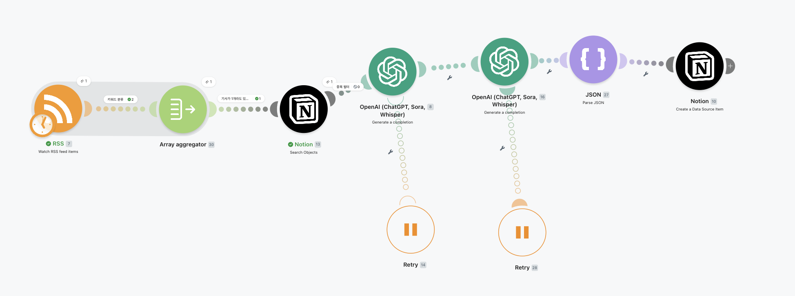

#### 스크린샷별 확인 내용

##### 1. 전체 워크플로우 화면


RSS 수집부터 Notion 저장까지 전체 모듈이 순차적으로 연결되어 있고, ChatGPT 노드 2개에 Retry 처리가 연결되어 있다.

##### 2. RSS 설정 화면

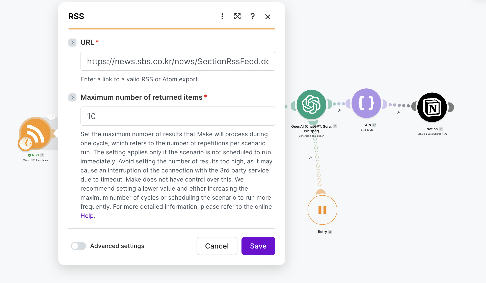

SBS RSS URL을 사용하며, 한 번 실행 시 최대 10개 뉴스 항목을 수집하도록 설정되어 있다.

##### 3. 키워드 필터 화면

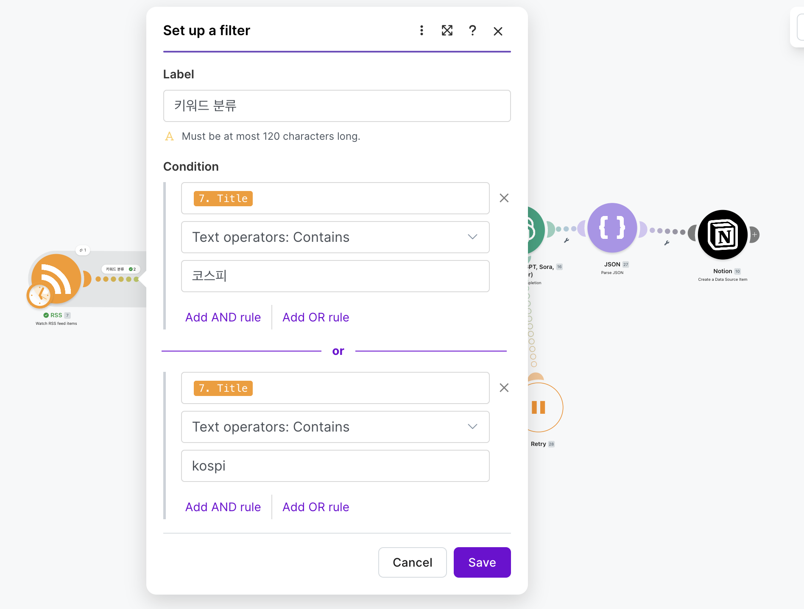

RSS 제목에 `코스피` 또는 `kospi`가 포함된 기사만 통과시키는 OR 조건이 설정되어 있다.

##### 4. Array aggregator 설정 화면

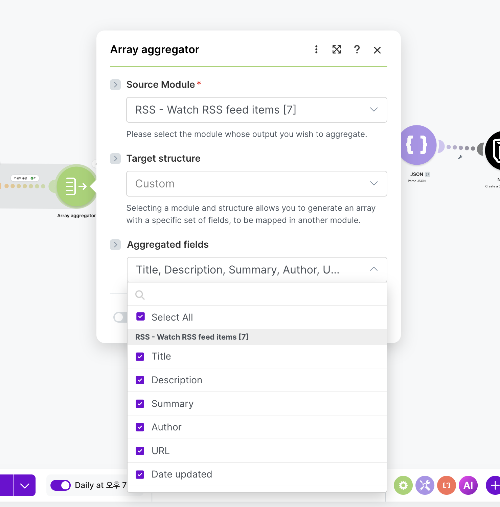

RSS 모듈을 Source module로 지정하고, 제목/설명/요약/작성자/URL/날짜/GUID 등 필요한 필드를 배열로 묶는다.

##### 5. 기사 존재 여부 필터 화면

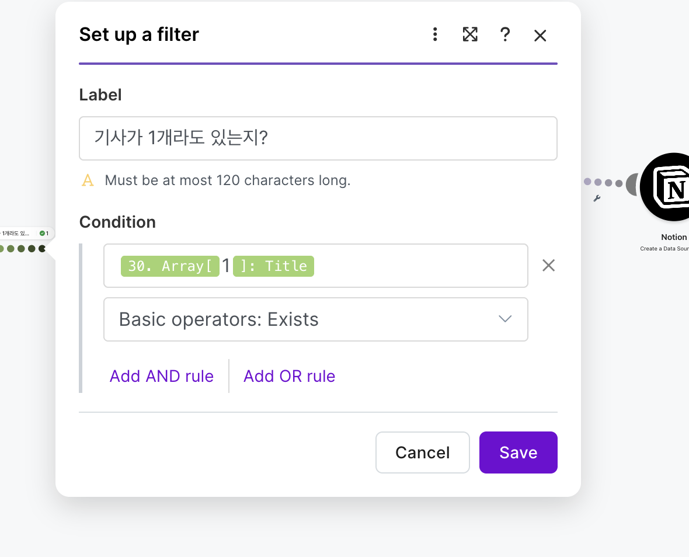

Aggregator 결과의 첫 번째 기사 제목이 존재할 때만 다음 단계가 실행되도록 설정되어 있다.

##### 6. Notion 중복 검사 화면

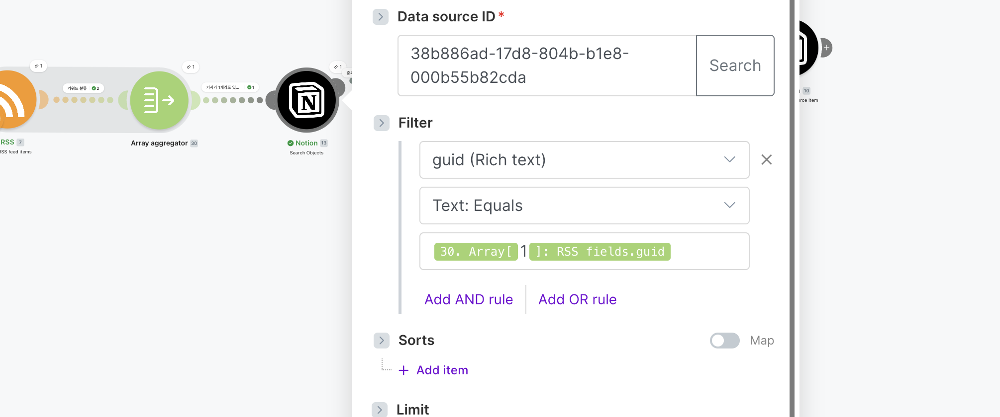

Notion DB의 `guid` 속성과 첫 번째 기사 GUID를 비교하여 동일 기사 저장 여부를 확인한다.

##### 7. ChatGPT 요약 설정 화면

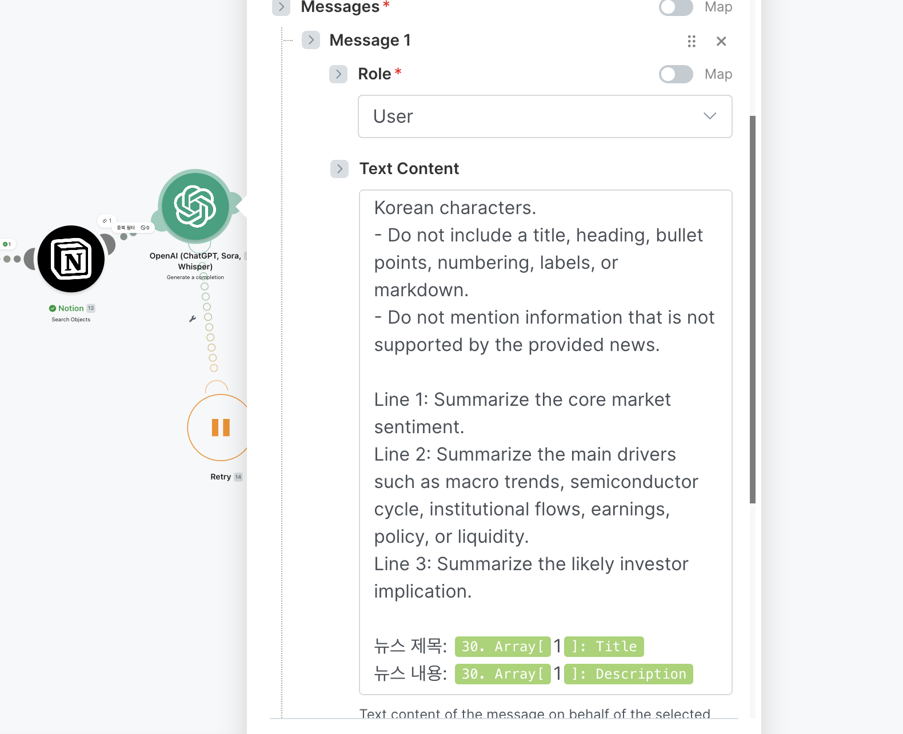

첫 번째 기사 제목과 본문을 입력으로 사용하여 한국어 3줄 요약을 생성한다.

##### 8. ChatGPT 키워드/태그 분석 화면

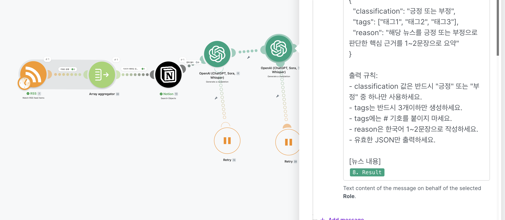

요약문을 입력으로 받아 긍정/부정 분류, 태그 3개, 판단 이유를 JSON 형식으로 생성한다.

##### 9. JSON Parse 설정 화면

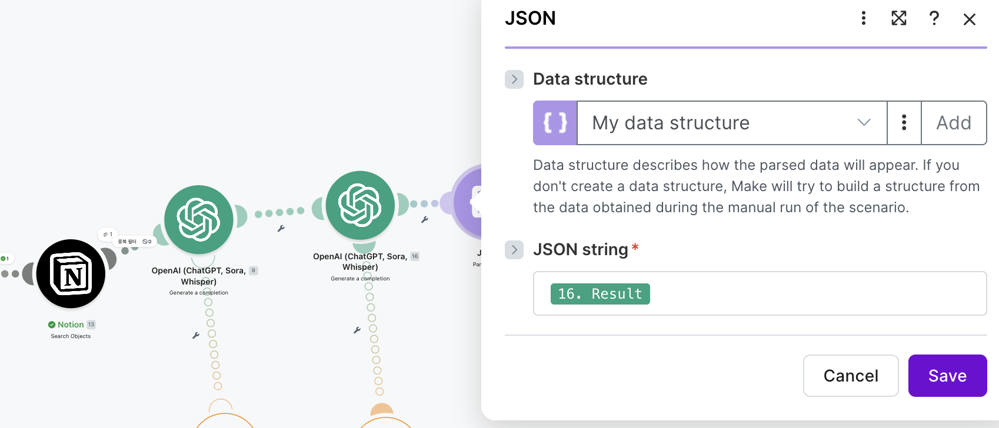

ChatGPT 분석 결과를 JSON으로 파싱하여 Notion 저장 단계에서 각 값을 사용할 수 있게 한다.

##### 10. Notion 저장 매핑 화면

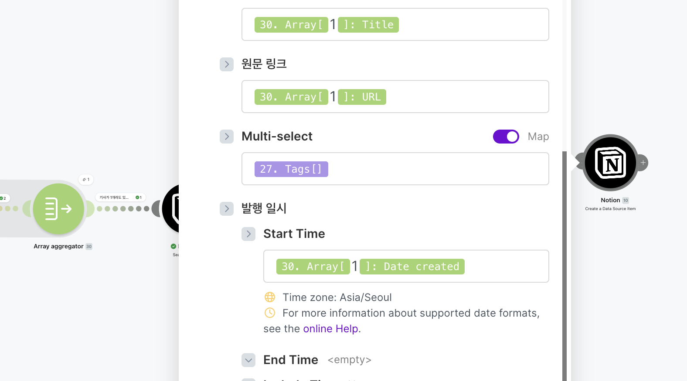

제목, 원문 링크, 태그, 발행일시 등이 RSS 및 JSON Parse 결과와 연결되어 있다.

##### 11. Retry 설정 화면

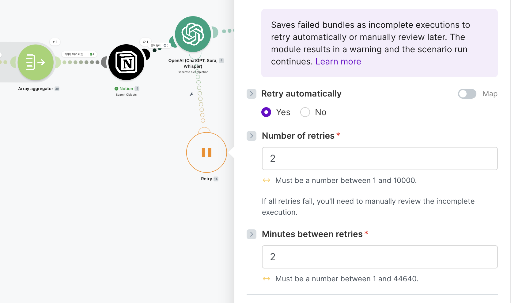

ChatGPT 실패 시 자동 재시도 Yes, 재시도 횟수 2회, 재시도 간격 2분으로 설정되어 있다.

### 2.2 Notion 데이터베이스 저장 결과

Make 워크플로우 실행 결과는 Notion DB에 자동 저장된다. 저장된 데이터는 제목, 요약문, 긍정/부정 분류, 태그, 원문 링크, 발행 일시, GUID 속성으로 구성된다.

Notion DB에서는 AI가 생성한 요약문과 감성 분류 결과를 한 화면에서 확인할 수 있으며, Multi-select 태그를 통해 뉴스의 핵심 이슈를 빠르게 분류할 수 있다. 또한 원문 링크와 GUID를 함께 저장하여 원문 확인과 중복 저장 방지가 가능하도록 구성하였다.

#### Notion DB 스크린샷

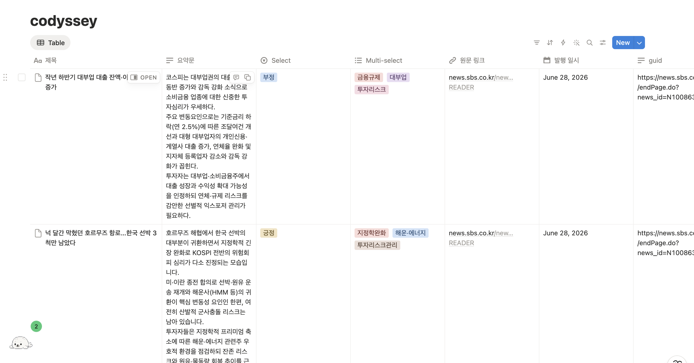

위 스크린샷에서는 자동화 결과가 Notion DB에 정상 저장된 것을 확인할 수 있다. 각 행은 하나의 뉴스 기사이며, 제목과 요약문뿐 아니라 AI가 분류한 긍정/부정 값, 요약문 기반 태그, 원문 링크, 발행 일시, GUID가 각각의 속성에 매핑되어 저장되어 있다.
